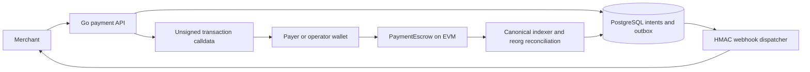

# SettleKit

SettleKit tracks token payments held in an on-chain escrow and tells a merchant when the payment has actually been confirmed.

A successful wallet transaction is not the whole story: a chain can reorganize, an API request can be retried, and a webhook receiver can be offline. SettleKit joins an ERC-20 escrow contract with a Go service, PostgreSQL state, and signed delivery notifications. It demonstrates how to keep an application payment record aligned with chain evidence while leaving wallet keys and transaction submission with the payer or operator.

## Payment lifecycle



A merchant creates an intent with an idempotency key. The payer signs `createAndFund`; the contract records the escrow and receives the exact token amount in one transaction. The indexer checks the observed terms against the intent and advances status after the configured confirmations. An operator can request unsigned calldata for a full release or refund, but only a canonical contract event changes the recorded money state.

## Engineering focus

| Problem | Design and resulting behavior |
| --- | --- |
| A client retries intent creation. | A scoped idempotency record and response commit together in PostgreSQL; an identical retry returns the original response and a conflicting body is rejected. |
| An ERC-20 transfer credits less than requested. | `createAndFund` checks the received balance atomically; a failed or undercredited transfer leaves no funded escrow. |
| A chain reorganizes after confirmation. | Canonical blocks, history, checkpoint, and outbox update together; the local status can be reversed and replayed rather than treated as irreversible. |
| The service or webhook receiver restarts. | Durable checkpoints and outbox entries survive restart. Webhooks use HMAC signatures and stable event IDs for receiver deduplication. |
| Release and refund compete. | The contract permits one terminal full payout, with immutable payer and payee; expiry makes refund permissionless while new funding and release can be paused. |
| A fallback RPC reports another chain or history. | Chain ID and stored checkpoint hash are checked before it can drive indexing; disagreement stops progress. |

The [protocol specification](SPEC.md), [architecture](docs/architecture.md), and [failure/security review](docs/security-review.md) explain the guarantees and residual risks.

## Quick start

Install Go 1.27.1, PostgreSQL 18 server tools, Foundry (`anvil`, `forge`), Python 3, `jq`, `curl`, and `openssl`. The local scenario starts disposable services and never sends a Sepolia transaction.

```sh
git clone https://github.com/demo-lenoir/SettleKit.git SettleKit
cd SettleKit
go mod download
make anvil-test
go test ./...
```

The scenario creates and funds intents, confirms them, releases and refunds separate escrows, verifies signed webhooks, restarts the service, tests reorganization reconciliation, and checks RPC failover. Follow the [demo guide](docs/demo.md) for its assertions. `make db-test` and `make contract-verify` provide focused checks.

### Verification status

The complete **local** gate, `make local-verify`, passes for this source tree. It covers Go tests and race/fuzz smoke, PostgreSQL integration, Foundry tests, Slither, Anvil behavior, clean-clone replay, vulnerability scans, SBOM, and image metadata. The stricter `make verify` also requires hosted CI for the exact published commit, a release sidecar, and read-only Sepolia/Etherscan checks. Its status remains pending until those external checks pass; see the [release plan](docs/release-plan.md). A local pass is not hosted CI evidence.

## Sepolia evidence

The verified [MockUSDC](https://sepolia.etherscan.io/address/0xA119A6483116208EC8E8823c35566AeD782bE2bA#code) contract was deployed in block 11830147 at **2 October 2026, 16:23:00 UTC** ([transaction](https://sepolia.etherscan.io/tx/0x676b183a2763a5743182f13f659672c915d07968948166db0b771db37234d7c1)). The verified [PaymentEscrow](https://sepolia.etherscan.io/address/0x9c8C9e0507f837c7F38b24EDD90B49c4842F4a17#code) contract was deployed in block 11830158 at **2 October 2026, 16:25:12 UTC** ([transaction](https://sepolia.etherscan.io/tx/0x2a6d8ef9536b66d5999b78bfae829ff7a158235ade3922ff715449eeb3ff6adc)). The [transaction manifest](docs/sepolia-evidence.json) and [deployment evidence](docs/deployment-evidence.md) include separate release and refund scenarios and their receipts. These on-chain records establish contract deployment and the recorded transactions; they do not prove that this backend revision processed them. Backend behavior is verified by local integration tests.

## Repository map

```text
cmd/             service and replay commands
internal/        API, payments, indexer, store, webhook, telemetry
contracts/       escrow, mock token, Foundry tests
migrations/      PostgreSQL schema
scripts/         local integration and release checks
api/             OpenAPI contract
docs/            operations, security, evidence, and ADRs
```

Read the [test evidence](docs/evidence.md), [OpenAPI contract](api/openapi.yaml), [runbook](docs/runbook.md), [threat model](docs/threat-model.md), and [ADRs](docs/adr/) for more detail. [Source identity](docs/source-identity.md) explains how the standalone source tree is checked against the deployed contracts.

## Scope and trust

The Sepolia token is freely mintable and has no monetary value. The contracts have no independent security audit and must not receive real assets. The service never holds wallet keys; webhook delivery is at least once and consumers must deduplicate events. Confirmation counts do not make chain history irreversible. Production custody, operations, and traffic testing remain outside this repository.

MIT License. See [LICENSE](LICENSE).
